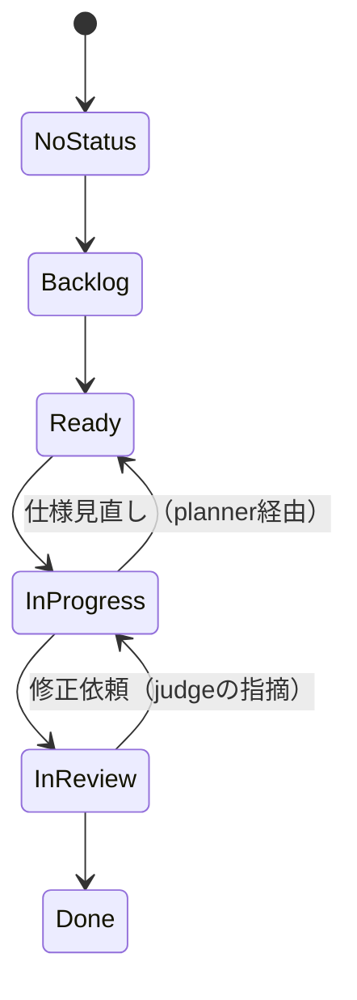

# Agents — マルチエージェント・ワークフロー（Draft, Minimal）

本書は **Who/How/Flow** を定義します。**What/Why/Done** は `requirements.md`（SSOT）を参照。

## 0. 層構造（Tiering）

* **Tier1**: **planner（orchestrator 兼務）** — *step2 以降すべての行動の起点*。`state` を操作し、tier2 に直接指示。
* **Tier2**: **coder / judge** — planner から直接指示を受ける中核。
* **Tier3**: **researcher** — planner を補助。

## 1. 役割と責務（Minimal）

* **planner（T1）**：

  * `state` を操作（No Status→Backlog→Ready→In Progress→In Review→Done）
  * tier2（coder / judge）へ直接ディスパッチし、優先順位と担当を調整
  * `spec/workflow/branching-strategy.md` に従い、GitHub ブランチ／PR を統制
  * GitHub 操作は MCP ツール（`github__create_branch`, `github__create_pull_request` など）経由で実施し、呼び出しログを `trace` に残す
  * `requirements.md` の保守（SSOT）／**tickets（作業単位）を発行・更新**
  * `reports` をレビューし、judge へ回すか要件見直しに戻すか判断
  * 必要に応じて **researcher（T3）** を呼び出し、外部情報でハルシネーションを防止

* **coder（T2）**：

  * 実装・実験。`trace`（変更ログ）を記録、成果を `reports` に集約
  * 単体/統合テストを実行し、結果を `reports` に反映

* **judge（T2）**：

  * `reports` と `trace` を基に最終判定（承認・差戻し）
  * 差戻しの場合、該当 `reports` を訂正

* **researcher（T3）**：

  * planner の補助として、外部情報（WEB など）を調査・要約し、意思決定を支援
  * judge の指摘や coder の停滞を踏まえ、planner 要請で出動

## 2. 共有リソース（Containers）

* **tickets**：作業単位。**planner が発行・保守かつディスパッチの基準として活用**。
* **state**：進捗管理（No Status / Backlog / Ready / In Progress / In Review / Done）。planner が唯一の操作者。
* **trace**：変更ログ（日時・コマンド・git hash・設定差分・実行環境）。**judge が妥当性判断に使用**。
* **reports**（※`results` をリネーム）：

  * 「**何ができたか／できなかったか**」を明確化する要約置き場（表・図・短評）。
  * **planner は reports を見て**「judge に回す／要件見直しへ戻す」を判断し、必要な GitHub アクションを実施する。

---

## 3. ワークフロー（Mermaid・最小）

```mermaid
flowchart TD
  %% Tiers
  subgraph T1[Tier1]
    PLN[planner\n(SSOT保守 / state操作 / 直接指示)]
  end
  subgraph T2[Tier2]
    COD[coder\n(実装/実験)]
    JDG[judge\n(最終判定)]
  end
  subgraph T3[Tier3]
    RSC[researcher\n(外部情報/ハルシ防止)]
  end

  %% Containers
  TCK[(tickets)]
  ST[(state)]
  TR[(trace)]
  RPT[(reports)]

  %% Step1: planner が tickets を用意（SSOTに基づく）
  PLN --> TCK

  %% planner が進捗を制御し、tier2 に指示
  PLN --- ST
  PLN -->|assign| COD
  PLN -->|assign| JDG

  %% planner は必要に応じ researcher を起動
  PLN -->|必要に応じ| RSC
  RSC --> PLN

  %% coder 実装 + テスト
  COD --> TR
  COD --> RPT

  %% planner が reports を見て判断
  RPT --> PLN
  PLN -->|達成見込みあり/要審査| JDG
  PLN -->|未達/要要件見直し| TCK

  %% judge 判定
  JDG -->|承認| PLN
  JDG -->|差戻し| PLN
```

---

## 4. チケット状態遷移（state）— 操作者: planner



* **操作原則（最小）**

  * `Backlog→Ready`：依存解消＆着手可能になったら
  * `Ready→In Progress`：担当割当済み
  * `In Progress→In Review`：`reports/trace` が揃ったら
  * `In Review→Done`：judge 承認

---

## 5. ハンドオフ契約（I/O Contract, Minimal）

| Role       | 受け取る                              | 返す                                   | 主な完了条件           |
| ---------- | --------------------------------- | ------------------------------------ | ---------------- |
| planner    | tickets, reports, SSOT             | 指示（tier2/3へ）, state更新, tickets更新 | 正しいルーティング・状態遷移 |
| coder      | tickets, configs                   | 実装成果・テスト結果→**reports**, 記録→**trace** | テスト合格 & 受入基準充足   |
| judge      | reports, trace                     | 承認/差戻し                               | 要件適合の最終判断        |
| researcher | plannerの問い                        | 調査要約（外部根拠付き）                       | 判断材料が増えること       |

---

### 運用メモ（最小）

* **SSOTは `requirements.md`**。変更は必ずチケット経由で反映し、planner が state を更新。
* **reports を中心に意思決定**：できた/できないを即時に可視化し、planner が「judge 行き or 要件見直し」を決める。
* **coder がテスト結果まで reports に反映**（生ログは trace、意思決定は reports）。
* **researcher は“必要なときだけ”planner が呼ぶ**（外部根拠の注入でハルシ対策）。
